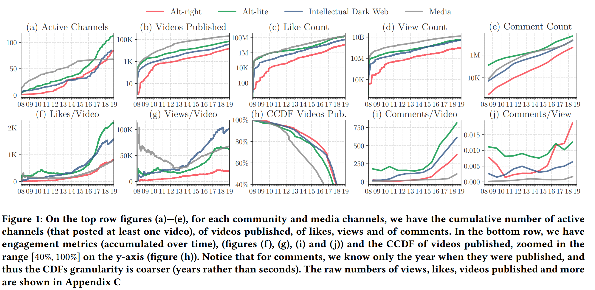
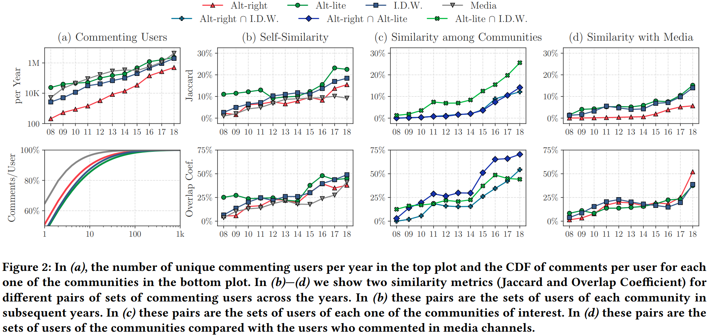

+++
title = "[Paper] Auditing Radicalization Pathways on YouTube"
categories = ["papers"]
tags = ["fat2020"]
draft = false
date = 2020-04-18
authors = ["Manoel Horta Ribeiro", "Raphael Ottoni", "Robert West", "Virgilio A. F. Almeida", "Wagner Meira Jr."]
+++

Does YouTube drive people to more extreme content? This is a question that many have posed, but this is the first paper to study this question in depth. I've had this on my reading list since I came across it on Twitter, so this Saturday I finally sat down to take a look.

<!--more-->

**Link**: [ACM Digital Library](https://dl.acm.org/doi/abs/10.1145/3351095.3372879), published at FAT* 2020, and there's an [8 minute talk](https://www.youtube.com/watch?v=zju-J53S4W0) from the conference too

**Authors**: Manoel Horta Ribeiro, Raphael Ottoni, Robert West, Virgilio A. F. Almeida, Wagner Meira Jr.

## Background
I've heard from many different places that YouTube's recommender systems unintentionally create a "radicalization pipeline," which gradually drives users to more extreme content. One notable place is an [opinion column](https://www.nytimes.com/2018/03/10/opinion/sunday/youtube-politics-radical.html) in NYT by Zeynep Tufekci. This is the first paper to quantitatively study the existence of such a pipeline.

Citing widepsread issues with identifying hate speech or extreme content, the authors choose instead to study *communities*: the "intellectual dark web" (IDW), alt-lite, and alt-right. Their research questions:

 > * **RQ1**: How have these channels grown on YouTube in the last decade?
 > * **RQ2**: To which extent do users systematically gravitate towards more extreme content?
 > * **RQ3**: Do algorithmic recommendations steer users towards more extreme content?

To study this, they (1) collect data on channels within these communities, (2) collect metadata and comments on videos in those channels (3) annotate the community membership of channels, and (4) collect video and channel recommendations. These are compared to traditional media channels as a baseline.

> We find strong evidence for radicalization among YouTube users, and that YouTube’s recommender system enables Alt-right channels to be discovered, even in a scenario without personalization. ... Moreover, regardless of the degree of influence of the recommender system in the process of radicalizing users, **there is significant evidence that
users are reaching content sponsoring fringe ideologies from the Alt-lite and the Intellectual Dark Web**.

## Community detection
I mentioned earlier that the authors chose to study communities instead of content, and it's worth spending time on how they identified these communities:

1. Choose a set of seed channels, from the IDW's website, the Anti Defamation League, and other reports on radcialization. Channels were annotated and discarded in the case of disagreement.
2. Choose keywords related to the communities (use YouTube search then consider the first 200 results).
3. Search related & featured channels of the ones identified above
4. Repeat step (3) again

For each channel, the authors collected subscribers & views, and for videos on the channel they collected (non-personalized) recommendations. The channels were labeled by domain experts (thank god) through a set of detailed instructions.

This is another example of the "seed and expand" process that I've seen used in lots of papers. Other papers I've read have used a similar methodology for doing lit reviews or studying the content associated with different hashtags on social media.

## Findings: channel growth & user similarities
This is another paper where a couple of figures give away the point.

This first figure shows exponential growth of alt-right, alt-lite, IDW, and media (the control) channels. The growth in non-media channels is much more recent, "corroborat[ing] with the narrative that these communities gained traction in (and fortified) Donald Trump's campaign during the 2016 presidential election."

Another key difference is in engagement: these fringe communities have substantially higher engagement (by multiple metrics) than traditional media.

The authors also study the users: the [Jaccard Similarity](https://en.wikipedia.org/wiki/Jaccard_index) and [Overlap Coefficient](https://en.wikipedia.org/wiki/Overlap_coefficient) help us to understand the intersection of users between different communities. Roughly 50% of alt-right commenters also commented in IDW and alt-lite communities.

More subtly, the Jaccard similarity between IDW / alt-lite and the media channels is close to the similarity between IDW / alt-lite and the alt-right. This suggests that "these communities do not exist in a vacuum, but are part of the existing online information environment." The overlap between these communities and the media channels is increasing since 2018, perhaps indicating they are becoming more mainstream.

## User migration
**How do you study radicalization?** In this work, by finding users who *did not* comment on alt-right content in a given year, and studying what they do later in time. Figure 3 in the paper basically shows that up to 12% of users who consumed only IDW or alt-lite content went on to consume alt-right content in future years. This is higher than the exposure rate for users who consumed only media content.

**How much does this pipeline matter?** By doing that in reverse! Look at the users who comment on alt-right content, then see whether or not they were previously part of an alt-lite- or IDW-only group. The answer is yes; 40% of alt-right commenters can be traced back to those groups, compared to just 6% of media-only groups.

This, to me, is the most remarkable result of the paper. It shows that alt-lite and IDW channels are indeed a gateway to more extreme content!

**What role did the recommender system have in this?** This is harder to study, because the authors didn't study personalization at all, and the recommendation algorithm for the majority of users will likely include that. It could be possible that the personalized recommendation system amplifies pathways present in the default one, or that it operates by a different mechanism entirely.

With that said, it's still an interesting question. The authors find that, if you click 5 times from an alt-lite channel, roughly 1 in 25 times you'll wind up at an alt-right channel. That may not seem like much, but considering the scale of YouTube it could very well be responsible for driving some of the growth!

## Discussion
To me, the most interesting finding is that people who *only* commented in alt-lite / IDW communities were more likely to reach alt-right communities in future years. This effect matters: up to 40% of the users within alt-right communities came from the alt-lite / IDW communities. This provides evidence for these communitiese being gateways to more extreme ones.

The paper does *not* find any evidence for the recommender system being the cause of this pipeline, nor does it find anything particularly strong about the recommender system in general. It's easy to blame the recommender system, and the media is [quick to do so](https://www.nytimes.com/2018/03/10/opinion/sunday/youtube-politics-radical.html):

> It seems as if you are never “hard core” enough for YouTube’s recommendation algorithm. It promotes, recommends and disseminates videos in a manner that appears to constantly up the stakes. Given its billion or so users, YouTube may be one of the most powerful radicalizing instruments of the 21st century.

**There is no evidence for this in the paper.** The paper doesn't rule it out, but this work only studied unpersonalized recommendations.

With that said, the natural question is what *is* driving this radicalization. It could plausibly be the case that the users from alt-lite / IDW communities get recommended alt-right videos, but that would need to be the subject of its own experiment.

Something I had to keep in mind is the effect of scale. A lot of the figures in the paper were, at first glance, relatively small effects: a 4% chance to wind up in an alt-right channel, or 12% of alt-lite / IDW users being radicalized within a year. But given how many users YouTube has, these small proportions can translate to millions of users or views.

Taken as a whole, this paper was really interesting! I was excited to see an algorithmic auditing paper cross my radar, and I'm glad that I took time to study it. This helps to inform my beliefs about radicalization and the impact of social media on our lives.

