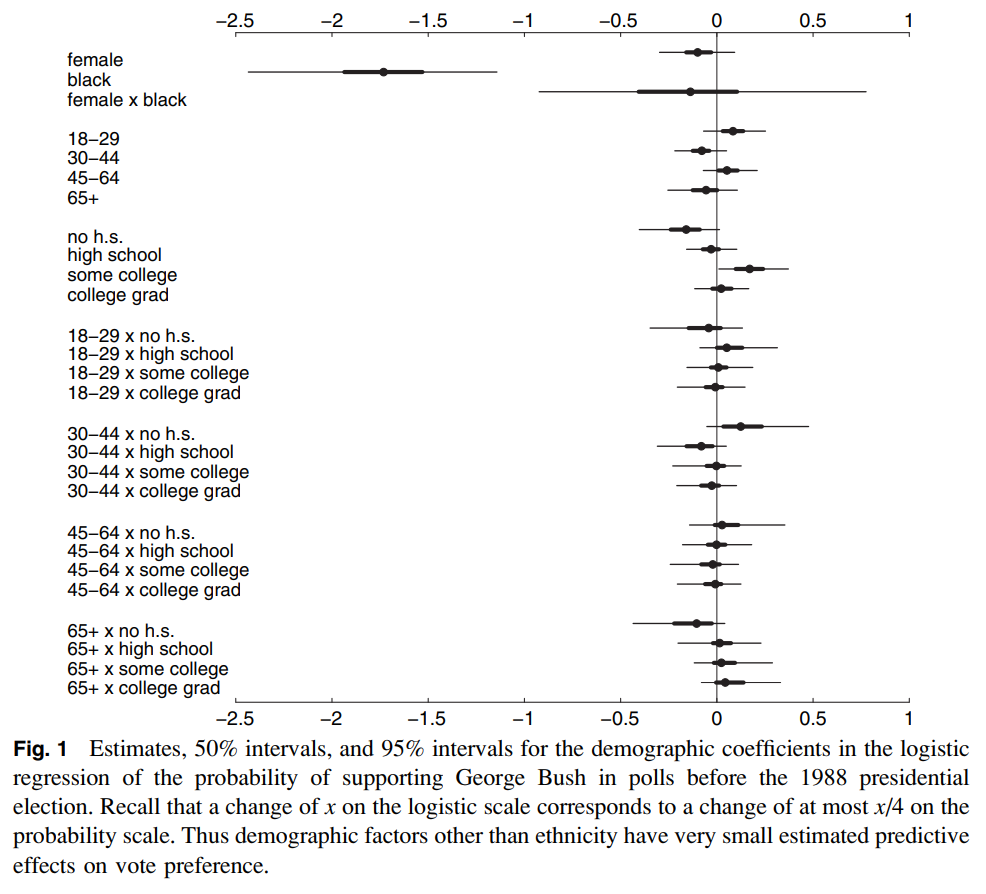

+++
title = "[Paper] Bayesian Multilevel Estimation with Poststratification: State-Level Estimates from National Polls"
date = 2019-11-26
draft = false
categories = ["papers"]
authors = ["David K. Park", "Andrew Gelman", "Joseph Bafumi"]
+++

This is a summary of the seminal paper by David K. Park, Andrew Gelman, and Joseph Bafumi. View the original on [Gelman's website](http://www.stat.columbia.edu/~gelman/research/published/parkgelmanbafumi.pdf).

<!--more-->

**How I found this paper**: I'm working on a Bayesian inference project at work, and Gelman's name of course appears repeatedly. I've seen this paper linked as a great one to read, so here we are.

## Summary
**From the abstract:** "We fit a multilevel logistic regression model for the mean of a binary response variable conditional on poststratification cells ... we apply it to US preelection polls for 1988 and 1992, poststratified by state, region, and the usual demographic variables ... the multilevel model outperforms more commonly used models in political science." In other words, they fit a multilevel (also called hierarchical) model for voting behavior.

Why fit a multilevel model? The authors are interested in estimating opinions at the state level, but have primarily national data. They're also interested in estimating opinions based on different demographics (sex, ethnicity, age, education). Even though most surveys won't have data in most categories, multilevel models are capable of sharing information across groups. It's also appropriate because "the data have a hierarchical demographic and geographic structure."

They model the probability that an individual is a supporter of the Republican candidate from 0 (indicating they support the Democrat) to 1, excluding undecideds and things like third parties.

```
logit p(y = 1)
    = β_0
	+ β_female * female[i] + β_black * black[i]
	+ β_female,black * female[i] * black[i]
	+ β_age[age[i]] + β_edu[edu[i]] + β_age,edu[age[i], edu[i]]
```

(I need to set up this blog to handle LaTeX ...) In this equation, `female[i]` and `black[i]` are indicator variables, and the `β_age` and `β_edu` are additive factors based on age and education.

They then set up a state-level model:

```
β_state[j] ~ N(β_region[region[j]] + β_previous * previous[j], σ_state^2)
```

where `previous[j]` is the Republican vote share in the previous three elections.

The model can be extended to handle "leaners" or undecided voters by using an ordered probit to handle a scale of intermediate opinions. It can account for turnout and third-party candidates by building one model for whether or not people are registered / expected to vote; another model *on those people* for those expected to vote for either of the two major-party candidates; and a third model on *those* major-party-voters for which major-party candidate they will vote for.

**Data**: from a CBS/NYT national poll. The poll had no data from Alaska or Hawaii, but by virtue of constructing a multilevel model we can still make estimates for those states based off demographic information! They fit the model in WinBUGS (is it available anywhere?), then inspected the fitted coefficients.



Demographic variables besides ethnicity don't seem to have a large effect. Another figure (not shown here) shows how, despite having no data for Alaska, we still recover a reasonably precise estimate. When looking at `previous` (the proportion of Republican vote in previous elections), "region and previous vote give good, but not perfect, predictions of state-level coefficients."

**State-level estimates**: now that we have a fitted model, we can use those to simulate the probability that a person prefers the Republican candidate, given their {sex, ethnicity, age, education, and state}. They do this, then compare to actual election results, and results (not shown here) seem fairly reasonable.

**The takeaway:** multilevel modeling is super powerful! On the surface, one might expect polling data to be pretty simple--it's an estimate of how likely one candidate is to win, right? But the authors are able to extract quite a bit of information from a single poll, including info that wasn't actually present (Alaska). The poststratification allowed the authors to correct for nonresponse bias and weight their estimates by demographics by state.

## Thoughts, connections, and questions
I've been studying this for just a few months now, and I'm continually in awe of how elegant Bayesian methods are. The image above has so much information in it--which variables matter, how certain we are about them, what the interactions between them are. Doing this in the frequentist paradigm would be a nightmare of statistical tests; with MCMC we get them all at once.

Likewise, simulating the probability that any particular person will prefer the Republican candidate is almost trivial--draw values from the posterior, plug them into the model, and out comes a result. Repeat until you have an uncertainty estimate that you're satisfied with.

I think the part of this that I'm least comfortable with is the posterior diagnoses and checks. Once I have an MCMC trace, there are some obvious things to do--convergence checks, verify that learned distributions are vaguely reasonable, look for things that I expect to be present (differentiation between groups, etc.), and draw from the posterior and study those predictions. This is where everything gets fuzzier, though; the authors here were lucky to have actual election data to benchmark with, but our problems aren't always that nice.

Finally, it feels good to have gotten through one of (what I have heard to be) the foundational papers in Bayesian inference & statistical modeling. I would love to see (or myself do) an implementation of this if the data is available.

