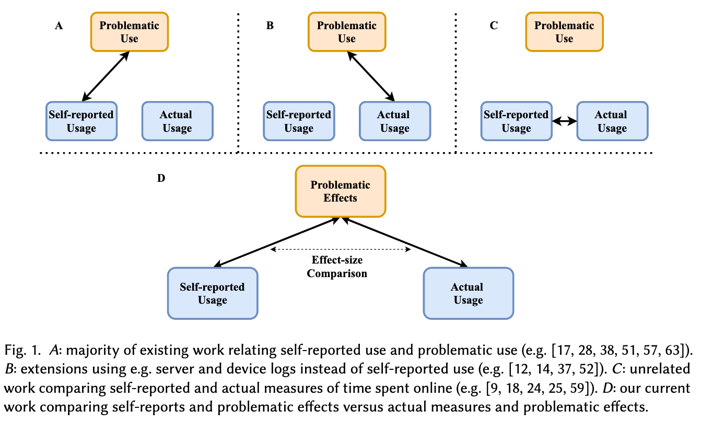

Self-reported measures of time spent online are known to be inaccurate compared to objective, server-log-informed measures. And while they're each individually useful in predicting problematic effects online, little is known about how these two measures can be used alongside each other. This CSCW paper uses the open-source, open-data platform Lichess to study this.

<!--more-->

**Link**: [PDF](http://www.cs.toronto.edu/~ashton/pubs/timeonline-cscw2020.pdf) (I couldn't find an ACM DL link for some reason? but it's in the CSCW proceedings)

**Authors**: Lillio Mok, Ashton Anderson

## Background and motivation
It's no surprise that using online platforms can have negative impacts on one's life. Researchers wonder whether the time spent on a platform is associated with the negative effects. Some work has studied this by relating measures of well-being to either self-reported or actual (server-based) measures of usage.

We also know that self-reported measures of internet activity are typically unreliable. I wrote about a paper from CHI 2020 titled [How Well Do People Report Time Spent on Facebook?: An Evaluation of Established Survey Questions with Recommendations
](), and a [2013 paper by Reynol Junco](https://dl.acm.org/doi/10.1016/j.chb.2012.11.007) was probably first to show this.

This paper asks how self-reported and actual measures of platform usage are related *within the context of problematic effects on online platforms.* That is, are they complementary in predicting negative effects, or are they redundant? The goal is to investigate self-reports and actual usage side-by-side.

This image is elucidating:

> RQ: How are self-reported and actual measures of time spent on online platforms comparatively associated with problematic effects of platform use?

The "problematic effects" here are "perceived sleep disruption, impacted relationships, and affected academic and workplace performance," along with "negative affective outcomes like loss of control and regret."

## On transparency
The authors note two major concerns with existing work in this space—

> First, the prior literature focuses almost exclusively on closed, for-profit online platforms. Research on closed platforms is difficult to reproduce and hold to rigorous scientific standards.

Access to relevant data is restricted to affiliated researchers (I've [written]() about [this]() before; see the last sections in both). As a result, they study the open-source, open-data online chess platform Lichess.

> Furthermore, for-profit platforms may be designed to incentivize engagement, thus potentially confounding "organic" problematic behavior with the effects of platform design.

This is interesting, though I'm not sure I agree. If Facebook's design leads people to stay there longer, and causes problematic behavior, isn't that worth studying? I think the authors are saying that we ought to separate that out from what they call "organic" problematic behavior, i.e., from just using the internet generally. But is it meaningful to study "the internet" in the absence of the most popular websites?

The other issue they note is that previous analyses yielding large negative correlations "have come under scrutiny for potentially making selective analytical decisions." As a result, they use Specification Curve Analysis, which I've never heard of, but which "combines the results from many reasonable analytical models simultaneously, so that they cannot be selectively chosen for larger and more significant effect sizes." Why don't other studies do this?

## How do we study platform usage and problematic effects?
To study self-reported platform usage, the authors administered a survey to Lichess users. Questions asked include how many days users think they played Lichess (in the month of June), what kind of game they played most and their rating, how many minutes they spent in-game, and what time of day they most often played.

To study actual platform usage, the authors looked at the game logs to compute (for each user) basically the same questions as above—the actual number of days they played, the average minutes played per day and per week, and the typical time of day that they played.

And finally, to study problematic effects, they used the survey from [Cheng et al.](https://arxiv.org/abs/1905.01911), who surveyed 20,000 Facebook users to study the same ideas. "It is more neutrally coded than surveys that are designed to diagnose pathological constructs."

## Findings
I like that the authors included different types of questions in the "platform usage" sections. "Participants were very adept at guessing their most-played variant ... and most recent chess rating," as you'd expect. But "self-reported time measures were highly inaccurate," deviating around 40% from the true values! In a way, the chess-related questions are controls to make sure that self-reporting isn't across the board garbage.

The authors ran linear regressions on the self-reported and actual time spent data to predict problematic behavior (assessed on a 5 point scale).

> Time spent is clearly associated with lower scores—negative measures of game time that we consider have significant, negative effects, and are consistent across both self-reported and actual measures of time spent. Thus, **despite the very week correlation between self-reports and actual quantities ..., [both] have some predictive power.**

They go into Specification Curve Analysis next. I don't know what this technique is, but the idea seems to be that you throw all your variables (actual and self-reported measures of time spent, and self-awareness, i.e., how well the participants reported their actual usage) into a hat, and run all possible multivariate regressions over subsets of variables.

Here, the authors find that actual and self-reported time spent are each associated with problematic behavior. This was expected from prior research, though it's good to confirm it. But *combining* them improves performance, which is a new result.
 
The authors included some qualitative research|qualitative questions at the end of their survey. As usual, I find these the most interesting: many participants discussed the value of Lichess, showed self-awareness that they play often, and sometimes noted that these have had negative impacts on their lives.

## My thoughts
I love the creativity behind studying an open-source, open-data platform, but I *really* wonder about the extent to which we can draw any conclusions from this. Intuitively, it feels like a chess platform is very different than Facebook here!

On the other hand, the participants did talk similarly about Lichess as we see with other online platforms. This included concerns about playing too much or being addicted, spending lunch breaks or off hours playing (just like people spend lunch on Facebook), or feeling like it enriched their lives.

Because the researchers recruited on Reddit, among the 129 (of 131) participants who reported demographic information, 115 were under 35, and 127 identified as male. The conclusions here should probably not be extrapolated to other demographic groups—women obviously have a different experience on social platforms than men do. Granted, this is probably not *that* poorly representative of the chess community.g

The authors note some questions about construct validity that nearly all work in this space shares. "While we included survey items that might be neutrally and objectively answered, ... the same aggregate Phase B scores for two participants may not imply that they feel negative outcomes to the same degree." Or that they feel negative outcomes at all!

I particularly enjoyed the discussion about transparency challenges in studying social platforms. I think, given those transparency and reproducibility constraints, this paper puts forth some fresh methods. I don't fully understand the use of SCA, but the authors seem confident that it's a robust analytical framework, and I'm always happy to learn new methods. 

Finally, the key (to me) finding that self-reported and actual measures of time spent are valuable in combination is worth remembering. That they contain different information should hopefully shift the perspective from self-reported measures being worse than actual measures to the two being complementary.

