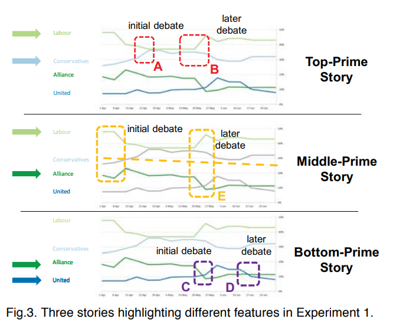

+++
title = "Paper: The Curse of Knowledge in Visual Data Communication"
date = "2019-11-13"
draft = "false"
categories = ["papers"]
+++

This is the first of (hopefully!) many paper reviews I'll be writing on this blog. Inspired by [The Morning Paper](https://blog.acolyer.org/about/), my goal is to read a lot of papers over the next several months (and longer). This one is a psychology paper by Cindy Xiong, Lisanne van Weelden, and Steven Franconeri. View it on the [Northwestern Psychology department](http://visualthinking.psych.northwestern.edu/VisualizationCurse2017/Xiong,%20van%20Weelden%20&%20Franconeri%20InfoVis%202017%20.pdf).

<!--more-->

## Summary
The authors write in the abstract "when people are primed to see one pattern in the data as visually salient, they believe that naive viewers will experience the same visual salience." In other words, after you think a visualization has some "most important features," you'll expect others to think the same.

Study participants were shown a graph & background knowledge of the graph; the graph was a line chart of (hypothetical) political polling data over time. Participants were asked to circle what they thought were the most salient features on the graph, then predict how salient those would be to others.

**Experiment 1a**: participants read one of three versions of a story about the above image, then saw the appropriately annotated image. One version said that the primary competition in this election was between the top 2 parties, one between the bottom two parties, and one between the 1st and 3rd party. Participants were asked what *uninformed* graph viewers (who didn't hear the story) would see, and generally said that those viewers would see as most salient the same features that they saw.

**Experiment 1b**: same as 1a, except this time all participants saw an unannotated image. The purpose was to separate the effects of the visual annotations and the story. Most participants had the same thing happen as in 1a, but the effect was weaker.

**Experiment 1c**: they changed the instructions to be more clear in what the participants should select, to avoid them circling e.g., the entire y-axis. The results were consistent with the others, though again weaker.

**Experiment 2**: they did the same experiment (prime participants with a story and ask what features they think are most important), but this time with a bar graph & totally different situation. This was to see how well their findings generalized to other visualization types.

**The takeaway**: "When a participant was told one of three possible background stories, each of which made a particular pattern within a graph visually salient to them, that participant assumed that naïve viewers would also see the same pattern as visually salient. **This effect occurred despite explicit instructions to ignore what they knew,** and to take a naïve perspective" (emphasis mine). It becomes impossible (or at the very least harder) to step out of a position of knowledge!

## Thoughts, connections, and questions
How I found this paper: from a [Chicago data visualization meetup](https://www.meetup.com/Chicago-Data-Viz-Community/events/264113035/) where the PI of this lab, Steve Franconeri, spoke about some of their work.

On the importance of this paper: "We suspect the inability [of authors] to separate one's own knowledge and expertise from that of their audience can make visual data communication more difficult and less clear than presenters realize." In other words, it's easy to think a visualization makes a particular point, especially when you've been staring at it for a while.

Anecdotally, I've experienced this several times at work. Getting early feedback on visualizations has been valuable to me as a researcher. The same is true of other things, too--my work seems really simple when I am talking to my boss or teammates, but I always have to take a step back when giving a presentation or talking about it to a broader audience.

I love how clearly the experiments were explained in the paper, though at times it felt redundant (e.g., when using the same language to describe experimental setups). The authors were also exceptionally clear about their findings, and I loved the simplicity of the question.

