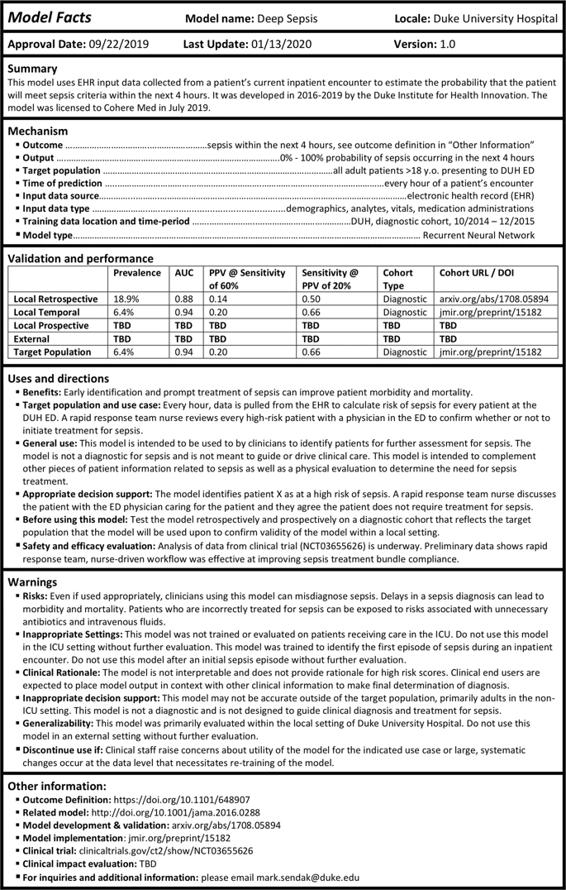

+++
title = "[Paper] Presenting machine learning model information to clinical end users with model facts labels"
date = 2020-04-12
draft = false
categories = ["papers"]
authors = ["Mark P. Sendak", "Michael Gao", "Nathan Brajer", "Suresh Balu"]
+++

This is another "interpeting machine learning" paper, this time in a medical context. The Duke researchers propose a "model facts" label, a la "nutrition facts" that we see on food packaging.

<!--more-->

**Authors**: Mark P. Sendak, Michael Gao, Nathan Brajer & Suresh Balu

**Link**: on [NPJ Digital Medicine](https://www.nature.com/articles/s41746-020-0253-3) (open access!)

## Background
I've read a number of papers on machine learning interpretability here. They span a few different open questions in the field, such as:

 * how do we develop interpretable or explainable models? how are these different? why do those differences matter?
 * how do we ensure responsible use of models? ([Proposed Guidelines for Reasonable Use of XAI]())
 * how do we document models? ([Model Cards for Model Reporting]())
 * what does interpetability even mean? how do data scientists use interpretability tools? ([Interpreting Interpretability]())

From the abstract:

> This perspective presents the “Model Facts” label, a systematic effort to ensure that front-line clinicians actually know how, when, how not, and when not to incorporate model output into clinical decisions. **The “Model Facts” label was designed for clinicians** who make decisions supported by a machine learning model and **its purpose is to collate relevant, actionable information in 1-page.** Practitioners and regulators must work together to standardize presentation of machine learning model information to clinical end users in order to prevent harm to patients.

This paper is most similar to the [Model Cards for Model Reporting]() in that it is another proposal for model documentation, but what sets it apart is the fact that Model Facts are aimed at clinicians in particular.

The basic idea is simple: if models are being used to help guide decisions in clinical settings, then the people using them need to be aware of what the models can and cannot do. The clincial setting makes this even more important than usual: the authors motivate this paper with an example from a 2015 MSR model:

> The goal was to identify which patients with pneumonia needed inpatient admission and which patients could be managed in the outpatient setting. The model found that patients with asthma were at lower risk of death, due to the fact that patients with asthma were admitted to the intensive care unit and received appropriately escalated care. If that model were integrated into clinical workflows without a clear indication for use, it’s easy to imagine patients with pneumonia complicated by asthma inappropriately treated less intensively.

It's almost too easy to imagine something like this being used now, as hospitals across the country are well over their capacity to treat COVID-19 patients.

## "Model Facts"
The authors motivate the work with an example model used to "estimate the probability that the patient will meet sepsis criteria within the next 4 hours." This paper is a great example of one where a single figure gives away the point:

There isn't a lot to say here that isn't immediately visible in the image. There are basic facts about the model, discussions about when to use it, warnings for the failure modes or when to stop using it, and various metrics (hopefully these are useful?).

The "Warnings" section stands out to me the most. This is where having a targeted domain (the clinical setting) really shines, because the information is highly specific: do not use on patients in the ICU, use the scores from this model in context, here is information about generalizability, stop using it if this happens.

## The future of model documentation
Maybe this is the futrue of model documentation: domain-specific guidelines for how to do it. I've seen lots of calls for better model docs, and I of course agree---but, well, we have to make sure the documentation is useful to the people making decisions off it.

I think reaching the point of useful documentation (like, presumably, this) requires tight collaboration with your stakeholders (in this case, clinicians) from the start of the model development process. A model like this one (for predicting sepsis) likely required a lot of cross-functional work between the ML researchers and the clinicians and other domain experts.

Put otherwise, it's hard to imagine landing at a Model Facts card like this *without* tight collaboration the whole way. The Model Facts, then, is simply the condensed manifestation of knowledge that the different parties gained along the way.

The authors' conclusion is similar:

> Despite unanswered questions, **without bringing together practitioners and regulators to standardize presentation of machine learning model information to clinical end users, we risk significant harm to patients.** Any effort to integrate a model into clinical practice should be accompanied by an effort to clearly communicate how, when, how not, and when not to incorporate model output into clinical decisions.

ML researchers and model-builders *have* to work closely with the people their model effects. Not to do so is irresponsible at best, and harmful at worst.
