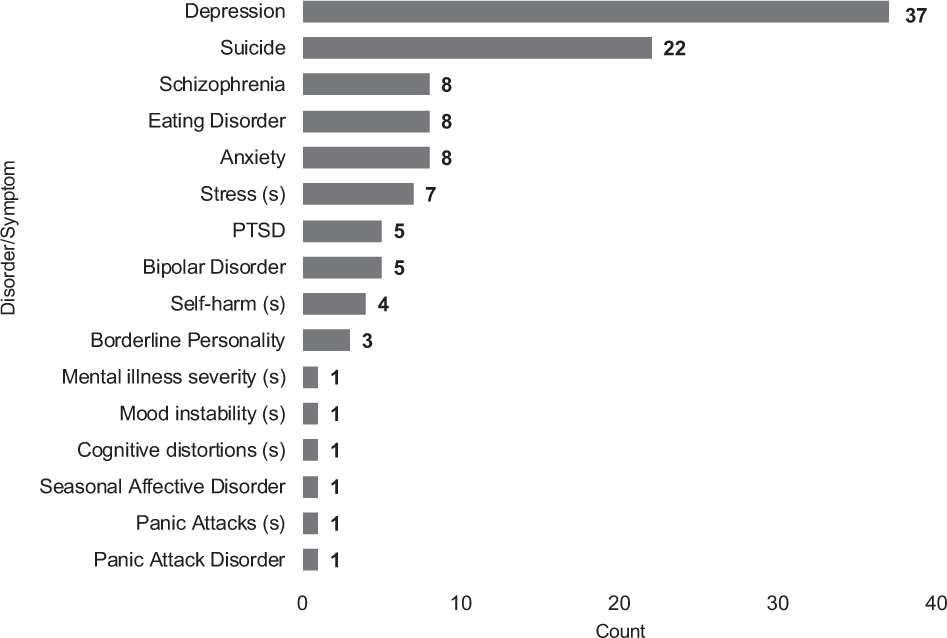

+++
title = "Paper: Methods in predictive techniques for mental health status on social media: a critical review"
date = 2020-03-26
draft = "false"
categories = ["papers"]
authors = ["Stevie Chancellor", "Munmun De Choudhury"]
+++

This new paper is a literature review of predicting mental health states from social media, studying in particular the extent to which the papers report their methods in sufficient depth and clarity. They propose reporting standards for publications in this space.

<!--more-->

**Authors**: Stevie Chancellor and Munmun de Choudhury

**Link**: on [NPJ Digital Medicine](https://www.nature.com/articles/s41746-020-0233-7) (open access!), and an accompanying [Medium post](https://medium.com/@stevie.chancellor/are-we-building-robust-ai-for-mental-health-prediction-in-social-media-47d021f0bdb9)

## Background
Social media is used to predict mental health status (MHS); the most famous example is likely Facebook's [suicide prevention AI](https://about.fb.com/news/2018/09/inside-feed-suicide-prevention-and-ai/) (which is apparently a random forest?). I've read a couple other papers about this by Dr. Chancellor:
 * A Taxonomy of Ethical Tensions in Inferring Mental Health States from Social Media ([part 1]() & [part 2]())
 * [Who is the 'Human' in Human-Centered Machine Learning: The Case of Predicting Mental Health from Social Media]()
 * [Multimodal Classification of Moderated Pro-Eating Disorder Content]()

The authors write: "In this new interdisciplinary space, there are few shared guidelines for what constitutes valid assessment of MHS in social media." This paper's contribution is identifying the gaps before they start to emerge systematically---doing a lit review while the field is still new---and so it reviews the methods used in 75 different papers.

Nearly half the papers studied depression; another 22 studied suicidality, and 8 each studying eating disorders and anxiety. I've read a couple of the eating disorder papers before, since they are also by these authors (see the ones above, plus ["Norms Matter"]()); but the best part of this being a lit review paper is that it gives me tons of new reading material. 

## Characterization of methods used
**Almost everyone used classification**: 63 of 75 papers framed the problem as binary classification, 6 used a multi-class method, and 6 used regression models. Binary classification sets off alarm bells for something as complex as mental health status. I think this is made somewhat better by the fact that a lot of the systems rely on a human-in-the-loop to handle the nuance, using the classifiers as a first pass.

**How the dataset was annotated for the "positive" class**: given that nearly everyone framed this as classification, how did researchers determine who had a particular mental illness?
 * 27 of 75 studies had humans (clinicians, psychologists, CS researchers, crowdsourcers) to annotate directly or to verify an annotation
 * 25 used participation in different communities (like subreddits) or the use of certain hashtags on Twitter or Instagram
 * 17 used self-disclosure (people who stated they had a specific illness)
 * 14 used screening questionnaries, 10 used keyword use, and 9 used annotations from other research

The list above just captures the primary method, but human annotation was more widespread than just the 27 studies mentioned. It was a popular follow-up to approaches like hashtag usage or keyword matching. This is reassuring, though it's not clear to me how many of these humans are clinicians or similarly trained.

**How the control group was found**: ok, in two-class classification, who was the positive class compared to?
 * 29 of 75 studies validated the absence of the MHS of interest, occasionally involving experts in the process
 * 23 used a random sample of users from the platform they were studying
 * 22 studies used a lack of disclosure or lack of participation in a community as a control signal

I worry less about the control groups in these papers; I think if the positive dataset is of high enough quality, the differences between it and the control group will emerge with a good enough model.

**Managing data quality and sampling**: how were the datasets curated, subsampled, or otherwise filtered?
 * 28 of 75 studies removed data for not meeting minimum engagement or activity thresholds (# of posts, # of friends, length of time, etc.)
 * 17 studies placed further restrictions on MHS, like the time in which they occurred or having high precision requirements
 * 14 studies excluded people based on characteristics like age or posting language

The authors did *not* see any adjustments to correct for "other biases" (studied by [Olteanu et al.](https://www.frontiersin.org/articles/10.3389/fdata.2019.00013/full)), nor adjustments for sampling bias from limited access APIs, adjustments for demographics, or (except for two papers) the removal of spam and advertisements. That's worrisome---I wonder how much these confound the results. But given the lack of reproducibility in this space (sometimes for good reason), I don't know that we'll ever find out.

**Variable selection**: how did feature engineering go? All parenthesized numbers are the number of studies using a particular approach.
 * Only 42 papers reported the total number of features, ranging from 7 to 15,000+.
 * Language (68/75): the vast majority used linguistic signals. These include structural features (25), like the length of the post or POS tagging; character models (38) like n-grams, TF-IDF, or embeddings; topic modeling (14); linguistic style (18); or domain-specific vocabulary (13); or "general language measures" (18) (what?)
 * Behavior (37/75): 35 papers used features like posting frequency or geotags, and 31 used interactions with others (who they followed, who followed them, community membership, etc.)
 * Emotion (38/75): the majority of this category (36) used sentiment analysis from a variety of algorithms.

**Algorithm selection**: because almost all contributions were framed as *predicting* mental health status, most papers chose machine learning approaches and highlighted prediction results. No papers used causal approaches. 24 used SVMs, 15 used logistic regression, 7 used random forests, and a handful used other tree-based methods or regression techniques. 14 used deep learning.

> How were these algorithms selected for use? In all, 41/75 papers described their process for selecting their algorithm of choice. The vast majority of algorithms (30/41) were selected because they performed the best, experimentally chosen across several algorithmic options.

It seems to me that if most papers are indeed framing the work as a prediction problem, then many more should explain why they chose the algorithm they did. That's the subject of so many questions I get: "why are you doing it this way?" Even when the answer is "because it works the best based on \<x>", that's better than nothing.

**Validating algorithms**: 72 papers report how they validate the models (what the hell were the other 3 doing?), and 54 use k-fold cross validation. 20 used a blind hold-out set, and 14 ran the model multiple times to validate the fit. 70 papers reported performance in terms of standard ML or regression metrics (accuracy, precision, recall, F1, AUC, R^2, RMSE).

**Algorithmic details**: the authors were also interested in the reporting of five important factors for reproducibility: number of samples, number of features, algorithm used, validation method, performance metrics. Except the number of features, which was in 42/75 papers, all were reported in 70+.

I don't actually see this as a problem: the *number* of features is not nearly as important as the *kinds* of features used. It doesn't matter to me how many features a TF-IDF or NGram-izer spits out, but rather the fact that they were used. (This becomes more important when there are very few features, though!)

Of course, with all that said, the bar is really on the floor when it comes to machine learning reproducibility. An actual reproducible experiment would provide not just "we used 42 features," but code to generate those features from a dataset, a specification of the environment and software versions used (or better yet, a Docker image!), an end-to-end pipeline, and far more. The reason I call out number of features is because it is not, in my mind, as fundamental to the bigger picture as "number of samples" or "performance metrics." 

## Construct validity
One of my professors memorably said to me: "social scientists tend to overestimate how complex computing systems are, and computer scientists tend to underestimate how complex social systems are." I see this repeatedly in social computing: it leans too much on the "computing" and not enough on the "social."

This is one of the reasons I feel unqualified to go to grad school to research this sort of thing. Because my background is in computer science, and I did vanishingly little social science work while at Northwestern, I worry that my perspective is too narrow for this kind of human-centric, interdisciplinary field. I also worry about inadvertently being the ["I'm here to solve it with *algorithms!*"](https://xkcd.com/1831/) tech stereotype.

Reading so much in the last year has helped me to broaden this, but this is still something I often think about. I digress, though: all of this is to say that the paper addresses this.

> In our dataset, there was limited explication on the theoretical/clinical grounding of the MHS of interest, beginning with clearly defining what mental health concern is being measured, and how it is operationalized within the research. Specifically, **many papers did not leverage established theories in clinical science or clinical psychology to establish or ground the status they investigated**

Five studies examined the "concept of anxiety," but this concept is overloaded---it can mean anything from day-to-day anxiety from public speaking to a category of nervous disorders. Depression, too; it's "subtly implied" that this means major depressive disorder, but that's rarely made explicit.

This gets worse: while there are lots of ways to identify MHS, these are rarely validated. "For example, the use of hashtags is a unique way to identify discussions of depression, but does it accurately identify those who suffer from major depressive disorder or is it another group of people interested in the topic?"

I'll quote this paragraph in its entirety, because it's really good:

> These challenges with construct validity jeopardize the credibility of identifying MHS and the replication of these studies in the future. As Ernala et al. also found in their explorations of schizophrenia prediction on social media, **the operationalization of identifying MHS is not connected to theoretically or clinically rigorous definitions of mental health,** nor is the new method of identification formally or causally validated. Without construct validity being established, it is hard to know if the studies in our corpus indeed measure MHS in ways that may be useful for other audiences, such as clinicians, or if they are in fact measuring something else. Ernala et al. also showed that it is possible that we are measuring a complementary population of those interested in mental illness, of which a subset will likely have diagnoses. **However, if the implications of the work are being framed for clinical audiences and adoption, there must be stronger validation of the constructs in the research to be applied to clinical practices.**

## Towards better practices
What can we do? Let's start with construct validity: some studies were strong models of this (it's just that most weren't). Using clinically validated approaches is obviously good, and collaboration with domain experts is (in my view) critical. The authors reference a paper collaborating with an expert on suicidality to distinguish six kinds of tweets about suicide.

The authors propose basic standards for methodology reporting: ground truth validation procedures, data sources, features used, algorithm selection, validation metrics, performance metrics, and a few more. I've written about this before when I read [Model Cards for Model Reporting](), which I recommend to anyone interested in learning more about these standards.
