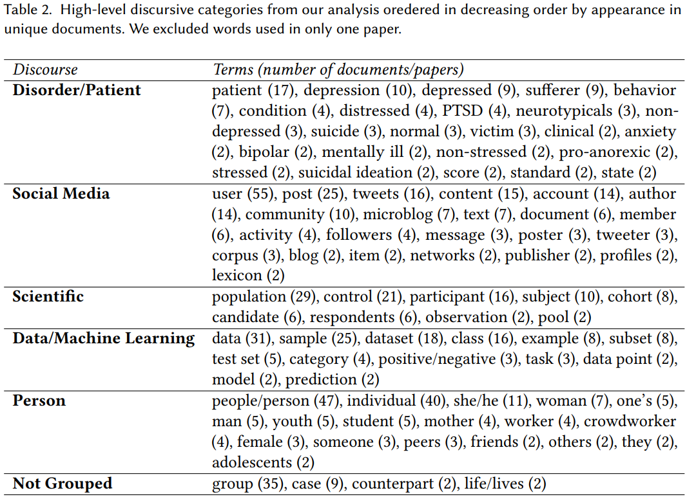

+++
title = "[Paper] Who is the 'Human' in Human-Centered Machine Learning: The Case of Predicting Mental Health from Social Media"
date = "2019-12-01"
draft = "false"
categories = ["papers"]
authors = ["Stevie Chancellor", "Eric P.S. Baumer", and "Munmun De Choudhury"]
+++

What does "human-centered machine learning" even mean? Who are the "humans" being studied, and how do papers studying them refer to them? This paper studies the *discourse* surrounding humans within HCML.

<!--more-->

**Authors**: Stevie Chancellor, Eric P.S. Baumer, and Munmun De Choudhury

**Link**: on [Dr. Chancellor's website](http://steviechancellor.com/wp-content/uploads/2019/09/HCML-CSCW-2019.pdf) or the [ACM DL](https://dl.acm.org/doi/10.1145/3359249)

## Summary
This is a meta-analysis of 55 papers within human-centered machine learning (HCML), focusing specifically on papers attempting to "predict mental health status" (see the author's [other paper]()) from social media. This field is receiving increasing attention and is both promising and dangerous. The authors write "data science efforts to understand [mental disorders] are inherently humanistic," which I love.

**Discourse:** the authors study "how the community describes [humans] in publications," referred to as *discourse*. "Discourse frames, shapes, and changes our formations of social and political structures, and how power and responsibility may be conferred to individuals and groups - with the ultimate goal of making such structures apparent for critique and change."

### Five representations of the human
The authors found 164 terms used to describe humans, then grouped these into 5 "discursive representations." I'll summarize how the authors discuss each representation.

**Human as patient / disorder**: many papers conceptualize people as clinical subjects; this can be inaccurate because of the direct implication that they're in a health care relationship. Discourse here often frames people without mental disorders as "normal," which is stimgatizing for those who do have them.

**Human as social media**: this is the most interesting to me. There are a lot of ideas at play here:

 * The term *user* was used in *every single paper*; some papers additionally use "poster" or "tweeter." This portrays humans as entities who use a platform or curate a social media profile.
 * Other discourse uses more impersonal terms, like "account" or "profile." In these cases, the "post" is later scaled to the human who created it.
 * The primary risk (and what the vast majority of researchers did) is reducing individuals to single posts, which are rarely placed in a broader context about who they are.
 * There is often an assumption that participation in a community is indicative of mental health status, which is a reductionist view of communities and participation therein. The term "community" was often used as a label, perhaps implying that e.g., a "depression community" exists.

**Human as a scientific subject**: the primary risk here is with imprecise language. The term "participant" implies active consent and human research ethics boards, which are often not present. The term "control" implies a control / treatment split, which is rarely the case with passive studies. The term "population" obfuscates who the research actually refers to (people who suffer from a mental disorder? people in a Reddit community? people sampled from a Reddit community?). These terms imply "experimental rigor and human subjects protections that are not realized through the actual experiment design."

**Human as data / machine learning object**: this translates people into part of an algorithm or ML pipeline. While useful in the context of describing ML systems, this is dangerously dehumanizing: the idea of "harvesting social media data" can make invisible the people who the data represents. This reduces people to their data (a common criticism of today's tech companies).

**Human as a person**: ah, the one that you would expect is totally fine! Nope. One paper imprecisely used the pronoun "she" to refer to people with eating disorders, alienating the third of those with eating disorders who are male, as well as nonbinary people. Other terms highlighted demographics--"mother" in a study of postpartum depression, or "teenagers" or "adolescents" for studies on high school students. Using this kind of language isn't a magic bullet; it's still complex and has potential for misuse.

All papers had at least 3 of 5 discourses present, and the majority had more. The authors present several examples of mixing discourses, and show that it's *very easy* to do so--otherwise natural-looking sentences can refer to people in as many as four different ways! These often-competing discourses risk dehumanization by reducing people to their profiles, data, or mental disorders, which lies in conflict with human-centered anything. This is *not* to say that we shouldn't use ML in this field; rather that we need to take care to "recenter the human ... and make [our] commitment to humans clear." I might go into this more in a future post.

**The takeaway**: language matters! The language that we use to describe the humans involved in these studies can seem like an afterthought, but the use of inconsistent and competing discourses may risk dehumanization. This paper demonstrates a need to ensure that human-centric ML is *actually* human-centric, and this starts with the language we use to talk about those people.

## Thoughts, connections, and questions
Four unrelated reactions.

(1) This paper seemed awfully long at first--the PDF checks in at 32 pages--but the actual text is "only" 22, and there are a ton of references due to the fact that this is basically a literature review. I was surprised by how easy it was to read!

(2) An unexpected benefit of this paper is that I now have a nicely curated list of papers in the data science / social media / mental health space. While I'm not sure how much my future research interests are aligned with this field, it's nice to have this list to refer to if I need something to read.

(3) I am certainly guilty of using inconsistent language myself. I learned to use "people-first" language (e.g., "a person with schizophrenia" rather than "a schizophrenic"), since the latter defines the person by their mental disorder, while the first recognizes that schizophrenia is but one part of their complex identity. This paper helps me to put that idea into a broader context--there are lots of other ways, good and bad, to refer to people.

(4) Lastly, I think this paper subtly raises a broader issue about the people behind these research studies. Potentially dehumanizing people through language is demonstrably an issue, but what does this say about how social media companies think about the "users" on their platforms? To what extent am I a "person" to Facebook, or an "account" on Twitter, or an "example" on Reddit? How much do platform owners care about the actual people using their platforms? And how does this positively or negatively impact--empower or dehumanize--those people?
