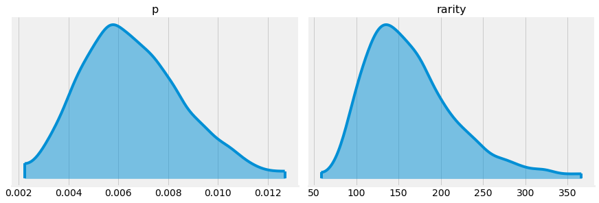
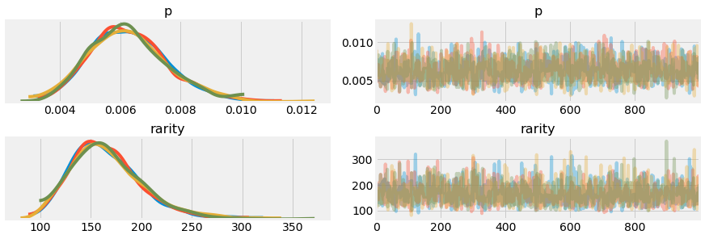
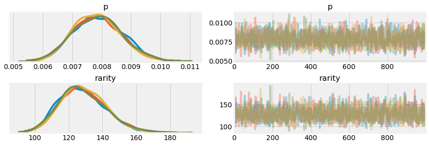
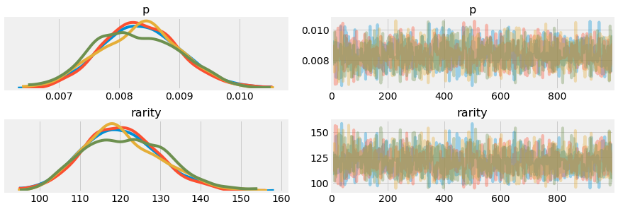
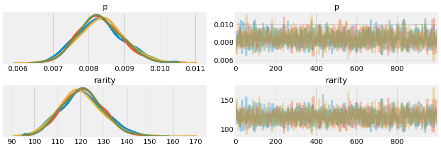
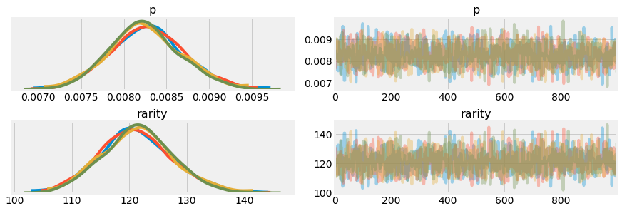
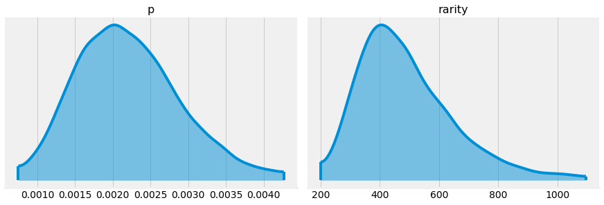
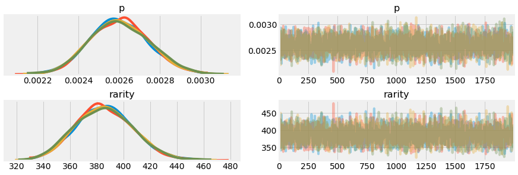

+++
title = "Pokemon GO shiny rates: a Bayesian perspective"
date = "2019-10-16"
draft = false
categories = ["general"]
+++

[The Silph Road](https://thesilphroad.com/) is the largest online and in-person network of Pokemon GO players and researchers. We investigate the question of how accurate their proposed shiny rates are by putting on our Bayesian hat, setting the "consensus" shiny rate as our prior, and using Silph field studies as observed data.

<!--more-->

## Background: Silph, shinies, and statistics
The Silph Road organizes regional groups of Pokemon GO players, sets up in-person tournaments, and conducts field studies to learn about game mechanics of Pokemon GO. Of particular interest to us here is the *shiny rate*, which is the probability that a Pokemon found in the wild will be shiny (for non-Pokemon players, this just means it's rare and specially coloured; it's like a trophy). Though not publicized by the game developer Niantic, this rate has been of great interest to Pokemon GO players (after all, shinies are not too far off from loot boxes).

Silph publishes [field studies](https://thesilphroad.com/science/oddish-shiny-rates/) to determine shiny rates, and these studies have resulted in two consensus rates: one "standard" rate of 1/450 (used for the vast majority of Pokemon), and one "boosted" rate of 1/150 (used during certain events). Recently, however, those rates have been [called into question](https://old.reddit.com/r/TheSilphRoad/comments/dd79zk/its_time_to_rethink_the_assumed_shiny_rates_from/) on the Silph subreddit, saying that they are not consistent with the collected data. I am going to re-examine these findings from a Bayesian perspective.

## Methodology
I went through the Silph archives looking for their shiny rate publications posted this year, and gathered them into a file `rates.csv`. The null rows in this file were the result of Silph not reporting their exact numbers (e.g., see [Spoink](https://thesilphroad.com/science/lunar-new-year-boosted-lucky-rates/) ("over 16,500 Spoink") and [Adventure Week](https://thesilphroad.com/science/quick-discovery/adventure-week-shiny-rates/) ("over 30,000 encounters each")). I chose to keep these in the dataset in case someone asks "what happened?" Additionally, the presence of two rows from the Gligar event were the result of an apparent change in the shiny rate after ~24 hours, which I am taking to be fact.


```python
import pandas as pd

rates = pd.read_csv("rates.csv")
rates.sample(5)
```


<div>
<style scoped>
    .dataframe tbody tr th:only-of-type {
        vertical-align: middle;
    }

    .dataframe tbody tr th {
        vertical-align: top;
    }

    .dataframe thead th {
        text-align: right;
    }
</style>
<table border="1" class="dataframe">
  <thead>
    <tr style="text-align: right;">
      <th></th>
      <th>url</th>
      <th>date</th>
      <th>name</th>
      <th>n_encounters</th>
      <th>n_shiny</th>
    </tr>
  </thead>
  <tbody>
    <tr>
      <td>18</td>
      <td>https://thesilphroad.com/science/quick-discove...</td>
      <td>20190629</td>
      <td>geodude_a</td>
      <td>6724.0</td>
      <td>19.0</td>
    </tr>
    <tr>
      <td>1</td>
      <td>https://thesilphroad.com/science/quick-discove...</td>
      <td>20190928</td>
      <td>zangoose_seviper</td>
      <td>8977.0</td>
      <td>24.0</td>
    </tr>
    <tr>
      <td>7</td>
      <td>https://thesilphroad.com/science/quick-discove...</td>
      <td>20190903</td>
      <td>gligar_later</td>
      <td>4234.0</td>
      <td>33.0</td>
    </tr>
    <tr>
      <td>14</td>
      <td>https://thesilphroad.com/science/quick-discove...</td>
      <td>20190727</td>
      <td>zubat</td>
      <td>844.0</td>
      <td>3.0</td>
    </tr>
    <tr>
      <td>9</td>
      <td>https://thesilphroad.com/science/quick-discove...</td>
      <td>20190824</td>
      <td>carvanha</td>
      <td>10386.0</td>
      <td>20.0</td>
    </tr>
  </tbody>
</table>
</div>


Let's compute the "rarity", defined as `n_encounters / n_shinies`. A rarity R means that we saw shinies with a rate of 1 in R.


```python
rates["rarity"] = rates["n_encounters"] / rates["n_shiny"]
rates = rates.dropna()
rates.sample(5)
```


<div>
<style scoped>
    .dataframe tbody tr th:only-of-type {
        vertical-align: middle;
    }

    .dataframe tbody tr th {
        vertical-align: top;
    }

    .dataframe thead th {
        text-align: right;
    }
</style>
<table border="1" class="dataframe">
  <thead>
    <tr style="text-align: right;">
      <th></th>
      <th>url</th>
      <th>date</th>
      <th>name</th>
      <th>n_encounters</th>
      <th>n_shiny</th>
      <th>rarity</th>
    </tr>
  </thead>
  <tbody>
    <tr>
      <td>20</td>
      <td>https://thesilphroad.com/science/go-fest-weeke...</td>
      <td>20190613</td>
      <td>horsea</td>
      <td>7303.0</td>
      <td>64.0</td>
      <td>114.109375</td>
    </tr>
    <tr>
      <td>4</td>
      <td>https://thesilphroad.com/science/quick-discove...</td>
      <td>20190919</td>
      <td>lillipup</td>
      <td>4567.0</td>
      <td>14.0</td>
      <td>326.214286</td>
    </tr>
    <tr>
      <td>3</td>
      <td>https://thesilphroad.com/science/quick-discove...</td>
      <td>20190919</td>
      <td>patrat</td>
      <td>4479.0</td>
      <td>16.0</td>
      <td>279.937500</td>
    </tr>
    <tr>
      <td>0</td>
      <td>https://thesilphroad.com/science/oddish-shiny-...</td>
      <td>20191004</td>
      <td>oddish</td>
      <td>10988.0</td>
      <td>94.0</td>
      <td>116.893617</td>
    </tr>
    <tr>
      <td>26</td>
      <td>https://thesilphroad.com/science/shiny-meltan-...</td>
      <td>20190225</td>
      <td>meltan</td>
      <td>7850.0</td>
      <td>128.0</td>
      <td>61.328125</td>
    </tr>
  </tbody>
</table>
</div>


Domain knowledge tells us that there are three classes of shiny rates here: a highly boosted one (around 1 in 60, for Alolan Exeggutor and Meltan), one boosted one (which Silph claims to be 1 in 150), and one normal one (which Silph claims to be 1 in 450). We can use this to partition the dataset manuallly, discarding the highly boosted samples because they're not relevant to this debate.


```python
boosted = rates[rates["rarity"].between(70, 200)].sort_values("date").reset_index(drop=True)
unboosted = rates[rates["rarity"] > 200].sort_values("date").reset_index(drop=True)
```


```python
boosted
```


<div>
<style scoped>
    .dataframe tbody tr th:only-of-type {
        vertical-align: middle;
    }

    .dataframe tbody tr th {
        vertical-align: top;
    }

    .dataframe thead th {
        text-align: right;
    }
</style>
<table border="1" class="dataframe">
  <thead>
    <tr style="text-align: right;">
      <th></th>
      <th>url</th>
      <th>date</th>
      <th>name</th>
      <th>n_encounters</th>
      <th>n_shiny</th>
      <th>rarity</th>
    </tr>
  </thead>
  <tbody>
    <tr>
      <td>0</td>
      <td>https://thesilphroad.com/science/extraordinary...</td>
      <td>20190522</td>
      <td>bronzor</td>
      <td>2479.0</td>
      <td>15.0</td>
      <td>165.266667</td>
    </tr>
    <tr>
      <td>1</td>
      <td>https://thesilphroad.com/science/go-fest-weeke...</td>
      <td>20190613</td>
      <td>horsea</td>
      <td>7303.0</td>
      <td>64.0</td>
      <td>114.109375</td>
    </tr>
    <tr>
      <td>2</td>
      <td>https://thesilphroad.com/science/quick-discove...</td>
      <td>20190704</td>
      <td>nidoran_m</td>
      <td>5722.0</td>
      <td>53.0</td>
      <td>107.962264</td>
    </tr>
    <tr>
      <td>3</td>
      <td>https://thesilphroad.com/science/quick-discove...</td>
      <td>20190727</td>
      <td>sneasel</td>
      <td>1588.0</td>
      <td>13.0</td>
      <td>122.153846</td>
    </tr>
    <tr>
      <td>4</td>
      <td>https://thesilphroad.com/science/quick-discove...</td>
      <td>20190806</td>
      <td>poliwag</td>
      <td>5627.0</td>
      <td>40.0</td>
      <td>140.675000</td>
    </tr>
    <tr>
      <td>5</td>
      <td>https://thesilphroad.com/science/quick-discove...</td>
      <td>20190903</td>
      <td>gligar_later</td>
      <td>4234.0</td>
      <td>33.0</td>
      <td>128.303030</td>
    </tr>
    <tr>
      <td>6</td>
      <td>https://thesilphroad.com/science/quick-discove...</td>
      <td>20190921</td>
      <td>yanma</td>
      <td>4052.0</td>
      <td>37.0</td>
      <td>109.513514</td>
    </tr>
    <tr>
      <td>7</td>
      <td>https://thesilphroad.com/science/oddish-shiny-...</td>
      <td>20191004</td>
      <td>oddish</td>
      <td>10988.0</td>
      <td>94.0</td>
      <td>116.893617</td>
    </tr>
  </tbody>
</table>
</div>


```python
unboosted
```


<div>
<style scoped>
    .dataframe tbody tr th:only-of-type {
        vertical-align: middle;
    }

    .dataframe tbody tr th {
        vertical-align: top;
    }

    .dataframe thead th {
        text-align: right;
    }
</style>
<table border="1" class="dataframe">
  <thead>
    <tr style="text-align: right;">
      <th></th>
      <th>url</th>
      <th>date</th>
      <th>name</th>
      <th>n_encounters</th>
      <th>n_shiny</th>
      <th>rarity</th>
    </tr>
  </thead>
  <tbody>
    <tr>
      <td>0</td>
      <td>https://thesilphroad.com/science/quick-discove...</td>
      <td>20190629</td>
      <td>diglett_a</td>
      <td>5373.0</td>
      <td>11.0</td>
      <td>488.454545</td>
    </tr>
    <tr>
      <td>1</td>
      <td>https://thesilphroad.com/science/quick-discove...</td>
      <td>20190629</td>
      <td>geodude_a</td>
      <td>6724.0</td>
      <td>19.0</td>
      <td>353.894737</td>
    </tr>
    <tr>
      <td>2</td>
      <td>https://thesilphroad.com/science/quick-discove...</td>
      <td>20190629</td>
      <td>rattata_a</td>
      <td>5179.0</td>
      <td>14.0</td>
      <td>369.928571</td>
    </tr>
    <tr>
      <td>3</td>
      <td>https://thesilphroad.com/science/quick-discove...</td>
      <td>20190727</td>
      <td>koffing</td>
      <td>24902.0</td>
      <td>65.0</td>
      <td>383.107692</td>
    </tr>
    <tr>
      <td>4</td>
      <td>https://thesilphroad.com/science/quick-discove...</td>
      <td>20190727</td>
      <td>ekans</td>
      <td>13018.0</td>
      <td>37.0</td>
      <td>351.837838</td>
    </tr>
    <tr>
      <td>5</td>
      <td>https://thesilphroad.com/science/quick-discove...</td>
      <td>20190727</td>
      <td>zubat</td>
      <td>844.0</td>
      <td>3.0</td>
      <td>281.333333</td>
    </tr>
    <tr>
      <td>6</td>
      <td>https://thesilphroad.com/science/quick-discove...</td>
      <td>20190824</td>
      <td>barboach</td>
      <td>9958.0</td>
      <td>23.0</td>
      <td>432.956522</td>
    </tr>
    <tr>
      <td>7</td>
      <td>https://thesilphroad.com/science/quick-discove...</td>
      <td>20190824</td>
      <td>carvanha</td>
      <td>10386.0</td>
      <td>20.0</td>
      <td>519.300000</td>
    </tr>
    <tr>
      <td>8</td>
      <td>https://thesilphroad.com/science/quick-discove...</td>
      <td>20190903</td>
      <td>sentret</td>
      <td>19297.0</td>
      <td>54.0</td>
      <td>357.351852</td>
    </tr>
    <tr>
      <td>9</td>
      <td>https://thesilphroad.com/science/quick-discove...</td>
      <td>20190903</td>
      <td>gligar_early</td>
      <td>1971.0</td>
      <td>3.0</td>
      <td>657.000000</td>
    </tr>
    <tr>
      <td>10</td>
      <td>https://thesilphroad.com/science/quick-discove...</td>
      <td>20190919</td>
      <td>patrat</td>
      <td>4479.0</td>
      <td>16.0</td>
      <td>279.937500</td>
    </tr>
    <tr>
      <td>11</td>
      <td>https://thesilphroad.com/science/quick-discove...</td>
      <td>20190919</td>
      <td>lillipup</td>
      <td>4567.0</td>
      <td>14.0</td>
      <td>326.214286</td>
    </tr>
    <tr>
      <td>12</td>
      <td>https://thesilphroad.com/science/quick-discove...</td>
      <td>20190928</td>
      <td>zangoose_seviper</td>
      <td>8977.0</td>
      <td>24.0</td>
      <td>374.041667</td>
    </tr>
  </tbody>
</table>
</div>


Let's start with the proposed boosted shiny rate of 1 in 150. We'll come back to the standard one later.

## The boosted shiny rate: the Bayesian way
Frequentist statistics would construct a confidence interval on these rates--it's a simple proportions test--and call it a day. Indeed, that's what both Silph (see every publication they put out) and [critics of Silph](https://old.reddit.com/r/TheSilphRoad/comments/dd6ln1/world_wide_oddish_shiny_rates/f2egcsx/) have done. After constructing this confidence interval, we simply check if 1/150 lies within it.

But we can do better than this yes/no response. Given that we believe that the boosted shiny rate is 1 in 150, the Bayesian way of thinking provides us with a natural way of incorporating this into our analysis: as a prior.


```python
import arviz as az
import pymc3 as pm

az.style.use("fivethirtyeight")
```

### Setting priors
Let's use a [Beta](https://en.m.wikipedia.org/wiki/Beta_distribution) prior over p, since a Beta can be used as a distribution over probabilities. Using the [success rate interpretation](https://stats.stackexchange.com/a/47782) of the Beta, our prior will be
fairly weak: equivalent to having seen 10 shinies in 1500 encounters. Put otherwise, our prior is that anything between 1 in 100 and 1 in 300 is plausible.

We'll add a second variable, rarity, which is 1 / p as defined before. This makes it easier to use phrases like "1 in 150" or "1 in N," and is more intuitive when talking about extremely small probabilities. For example, a rarity of 100 means that for every 100 Horsea you see, on average 1 will be shiny. Through the rest of this document, we'll mostly focus on the plots of the rarity.


```python
with pm.Model() as model:
    p = pm.Beta("p", alpha=10, beta=1490)
    rarity = pm.Deterministic("rarity", 1. / p)

prior_samples = pm.sample_prior_predictive(samples=10000, model=model)
```


```python
axes = az.plot_density(
    prior_samples,
    var_names=["p", "rarity"],
    point_estimate=None,
    credible_interval=0.99,
    shade=0.5,
    figsize=(12, 4),
)
```





From this, we can see that while 1/150 is at the center of our prior beliefs, we wouldn't be surprised with a rarity of 1 in 100 or 1 in 200 either. This is without having collected any data--if *all* we had heard was "the shiny rate is 1 in 150," but we weren't sure about that 150 number, this plot represents a plausible range of values.

### Adding data
One advantage of the Bayesian approach is that it lets us add as much or as little data as we have. We will demonstrate how our beliefs in the shiny rate change over time as we show our model more data (i.e., as we progress through time and have more shinies released).


```python
from typing import Tuple

def encounters_and_shiny(df: pd.DataFrame, species_name: str) -> Tuple[float, float]:
    """Given a species name, retrieve the number of encounters and number of shinies"""

    row = df[df.name == species_name].iloc[0]
    return (row["n_encounters"], row["n_shiny"])

assert encounters_and_shiny(boosted, "sneasel") == (1588, 13)
assert encounters_and_shiny(unboosted, "sentret") == (19297, 54)
```

Beacuse each encounter is independently shiny with probability p, a binomial distribution is appropriate for modeling the number of shinies we see. We will use Markov Chain Monte Carlo to learn the likely distributions over our parameters (shiny rate and rarity). In lay terms, we will try to infer a distribution of most probable values for those parameters, little by little as we see more data. We'll start with just Bronzor.


```python
with model:
    n_encounters, n_shiny = encounters_and_shiny(boosted, "bronzor")
    bronzor = pm.Binomial("bronzor", n=n_encounters, p=p, observed=n_shiny)

    trace = pm.sample(1000, chains=4)
```

    Auto-assigning NUTS sampler...
    Initializing NUTS using jitter+adapt_diag...
    Multiprocess sampling (4 chains in 2 jobs)
    NUTS: [p]
    Sampling 4 chains: 100%|██████████| 6000/6000 [00:03<00:00, 1821.65draws/s]


```python
_ = az.plot_trace(trace)
```





This plot represents what we might have believed in February 2019, after seeing 15 out of 2479 shinies for Bronzor. The left curves represent the likely ranges for the shiny rate p and the rarity 1-in-N. For those unfamiliar with MCMC, ignore the fuzzy-caterpillar-like plots on the right; for those familiar with it, this model exhibits excellent sampling behavior.

Notice how we're already seeing that these distributions are a little bit tighter. We see virtually no likelihood of the rate being 1 in 300 now, but earlier we did. Meanwhile, 1 in 150 remains a highly likely shiny rate given our limited data.

Let's add the next Pokemon we had an event for, Horsea.


```python
with model:
    n_encounters, n_shiny = encounters_and_shiny(boosted, "horsea")
    horsea = pm.Binomial("horsea", n=n_encounters, p=p, observed=n_shiny)

    trace = pm.sample(1000, chains=4)
```

    Auto-assigning NUTS sampler...
    Initializing NUTS using jitter+adapt_diag...
    Multiprocess sampling (4 chains in 2 jobs)
    NUTS: [p]
    Sampling 4 chains: 100%|██████████| 6000/6000 [00:03<00:00, 1835.00draws/s]


```python
_ = az.plot_trace(trace)
```





Because we observed a rate of 1 in 114 for Horsea, the likelihood for the rarity has now shifted much further left. It is now almost entirely implausible for the shiny rate to be any lower than 1 in 200, and even 1 in 150 is starting to look unlikely.

The next shiny released was Nidoran M.


```python
with model:
    n_encounters, n_shiny = encounters_and_shiny(boosted, "nidoran_m")
    nidoran_m = pm.Binomial("nidoran_m", n=n_encounters, p=p, observed=n_shiny)

    trace = pm.sample(1000, chains=4)
```

    Auto-assigning NUTS sampler...
    Initializing NUTS using jitter+adapt_diag...
    Multiprocess sampling (4 chains in 2 jobs)
    NUTS: [p]
    Sampling 4 chains: 100%|██████████| 6000/6000 [00:03<00:00, 1651.98draws/s]


```python
_ = az.plot_trace(trace)
```





Nidoran's observed rarity was 1 in 107 over 5700 encounters, shifting our rarity curve evne further left, and now it's becoming more clear that 1 in 150 is a pretty unlikely shiny rate. Let's do this one more time for Sneasel.


```python
with model:
    n_encounters, n_shiny = encounters_and_shiny(boosted, "sneasel")
    sneasel = pm.Binomial("sneasel", n=n_encounters, p=p, observed=n_shiny)

    trace = pm.sample(1000, chains=4)
```

    Auto-assigning NUTS sampler...
    Initializing NUTS using jitter+adapt_diag...
    Multiprocess sampling (4 chains in 2 jobs)
    NUTS: [p]
    Sampling 4 chains: 100%|██████████| 6000/6000 [00:03<00:00, 1844.41draws/s]
    The acceptance probability does not match the target. It is 0.9023306786521638, but should be close to 0.8. Try to increase the number of tuning steps.


```python
_ = az.plot_trace(trace)
```





At this point (perhaps earlier) I would feel confident saying that the shiny rate, whatever it is, is not 1 in 150. The Sneasel event happened in July 2019, and I'm writing this in October, so clearly that wasn't enough for the Pokemon GO community. Fortunately, four more events happened between then and now, and we can pass them all at once.


```python
with model:
    n_encounters, n_shiny = encounters_and_shiny(boosted, "poliwag")
    poliwag = pm.Binomial("poliwag", n=n_encounters, p=p, observed=n_shiny)

    n_encounters, n_shiny = encounters_and_shiny(boosted, "gligar_later")
    gligar = pm.Binomial("gligar", n=n_encounters, p=p, observed=n_shiny)

    n_encounters, n_shiny = encounters_and_shiny(boosted, "yanma")
    yanma = pm.Binomial("yanma", n=n_encounters, p=p, observed=n_shiny)

    n_encounters, n_shiny = encounters_and_shiny(boosted, "oddish")
    oddish = pm.Binomial("oddish", n=n_encounters, p=p, observed=n_shiny)

    trace = pm.sample(1000, chains=4)
```

    Auto-assigning NUTS sampler...
    Initializing NUTS using jitter+adapt_diag...
    Multiprocess sampling (4 chains in 2 jobs)
    NUTS: [p]
    Sampling 4 chains: 100%|██████████| 6000/6000 [00:03<00:00, 1762.18draws/s]


```python
_ = az.plot_trace(trace)
```





We can confidently say that **it is extremely unlikely that the boosted shiny rate is 1 in 150.** It is much more plausible that the rate is in the neighborhood of 1 in 120, as 150 hasn't even registered on our posterior plot of the rarity.

Notice how natural a fit the Bayesian way of thinking was: we have some prior beliefs (that the rate is 1 in 150), and some data (the Silph studies), and we can marry the two together to get a posterior (the plot we see above). It's clear that the data do not support our prior beliefs, but that's okay; we're researchers, and that's how this is supposed to work.

## The normal shiny rate (supposedly 1 in 450)
Let's look next at the normal shiny rate, which is supposedly 1 in 450. For brevity's sake, I won't take us through the step-by-step process again, but rather pass all the data at once.


```python
with pm.Model() as model:
    p = pm.Beta("p", alpha=10, beta=4490)
    rarity = pm.Deterministic("rarity", 1. / p)

prior_samples = pm.sample_prior_predictive(samples=10000, model=model)
```


```python
axes = az.plot_density(
    prior_samples,
    var_names=["p", "rarity"],
    point_estimate=None,
    credible_interval=0.99,
    shade=0.5,
    figsize=(12, 4),
)
```





Our prior is again relatively uninformative because we're not very confident in the particular value of 1 in 450. Let's add the data.


```python
with model:
    for name in unboosted.name.values:
        n_encounters, n_shiny = encounters_and_shiny(unboosted, name)
        _ = pm.Binomial(name, n=n_encounters, p=p, observed=n_shiny)

    trace = pm.sample(2000, chains=4)
```

    Auto-assigning NUTS sampler...
    Initializing NUTS using jitter+adapt_diag...
    Multiprocess sampling (4 chains in 2 jobs)
    NUTS: [p]
    Sampling 4 chains: 100%|██████████| 10000/10000 [00:10<00:00, 917.38draws/s]
    The acceptance probability does not match the target. It is 0.8849638700714829, but should be close to 0.8. Try to increase the number of tuning steps.


```python
_ = az.plot_trace(trace)
```





Here, too, we see that the prior belief of 1 in 450 is no longer likely after considering our data. According to the Silph studies, the true shiny rate is likely between 1 in 350 and 1 in 425.

To make things more complex: there's growing consensus that the true shiny rate is *rarer* than 1 in 450, not more common, which is the opposite of what this data says. See this [Reddit comment](https://old.reddit.com/r/TheSilphRoad/comments/dd79zk/its_time_to_rethink_the_assumed_shiny_rates_from/f2ey7wv/) for an example; using an unnamed dataset, this user and others in that thread feel confident in a 1 in 500 rate. The comment chain discusses why the Silph shiny data may be biased to making shinies appear more common, and it's very possible that this is the case. **These methods are only as good as our data is;** if our data is flawed, our conclusions will be too.

## Summary and highlights
We re-analyzed the Silph shiny data and found that both of the assumed shiny rates--the normal rate of 1 in 450 and the boosted rate of 1 in 150--are almost certainly inaccurate given the data. The boosted shiny rate is probably closer to 1 in 120; this has been corroborated by another user on Reddit. The unboosted shiny rate, given the data, is apparently closer to 1 in 380; however, another independent analysis has found the opposite, so more research is needed.

Let's draw attention to **how natural the Bayesian way of thinking was.** Given how people were framing this problem--"is the rate of 1 in 150 accurate?"--the Bayesian way let us incorporate this belief naturally into our analysis. We set that rate as a prior, then looked at how well the data supported it (in this case, it did not), then drew conclusions from this posterior. That's not to say the frequentist paradigm doens't make sense; rather that in cases like this, we can draw more informative conclusions than before, and we can easily incorporate multiple events' worth of data.

Finally: to Silph's credit, they are a group of volunteer researchers doing the best that they can. They have done as much (or more) for the Pokemon GO community as anyone else has. Their treatment of statistics is far better than the average person's, and I greatly appreciate the work that they have done to shed light upon the game mechanics and (more importantly!) educate the community. This analysis, and others like it, would not be possible without their work.
